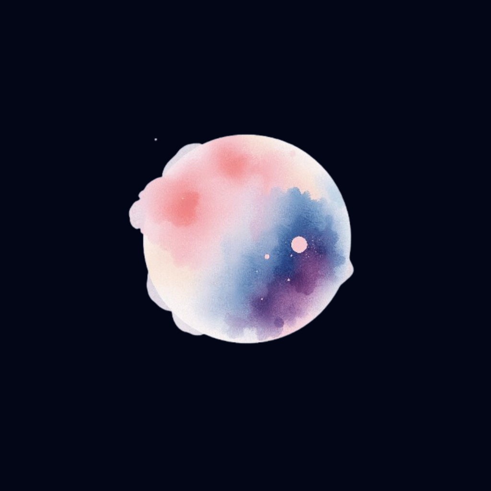
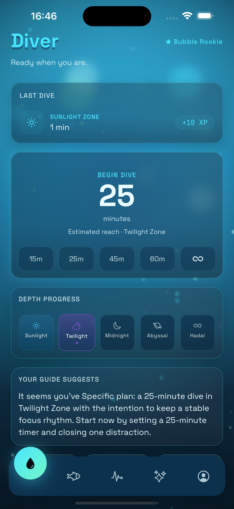
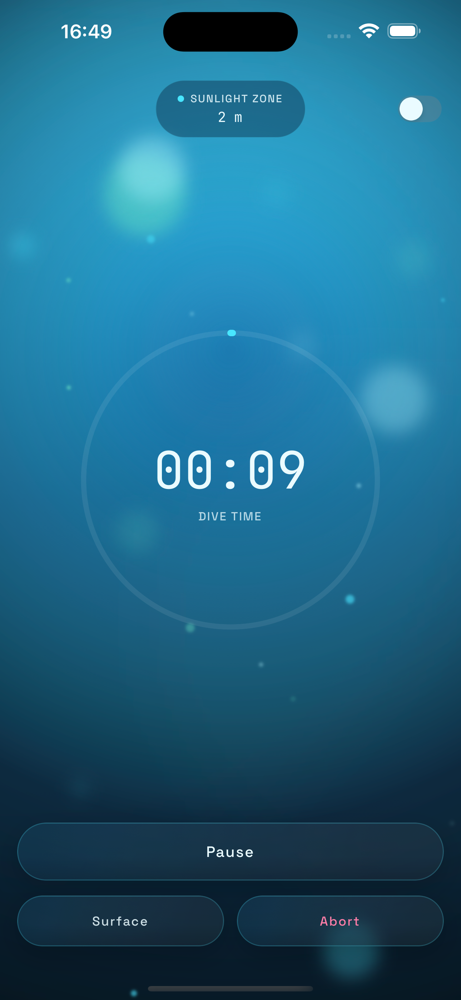
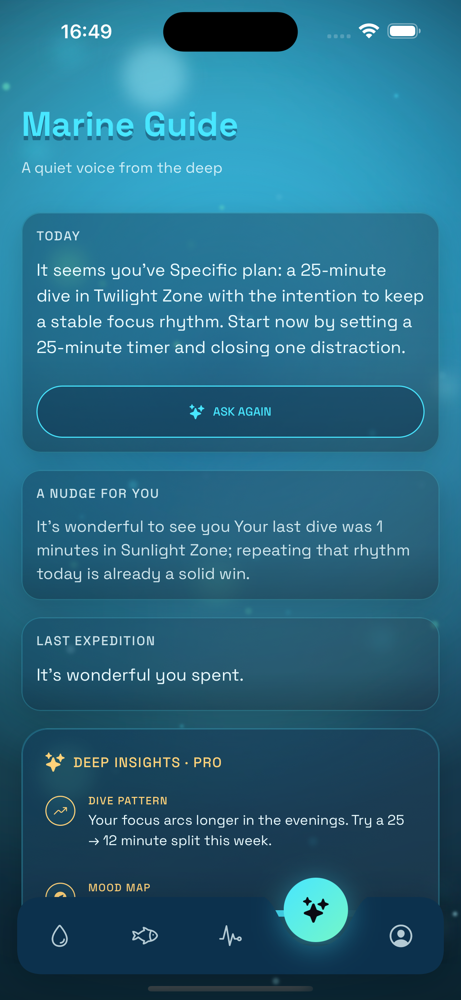
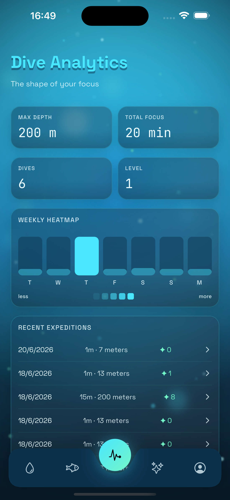
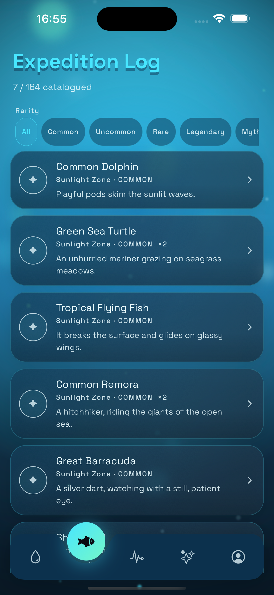
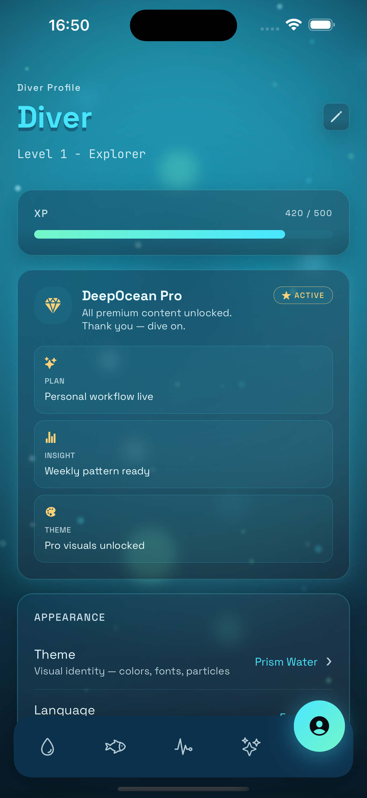
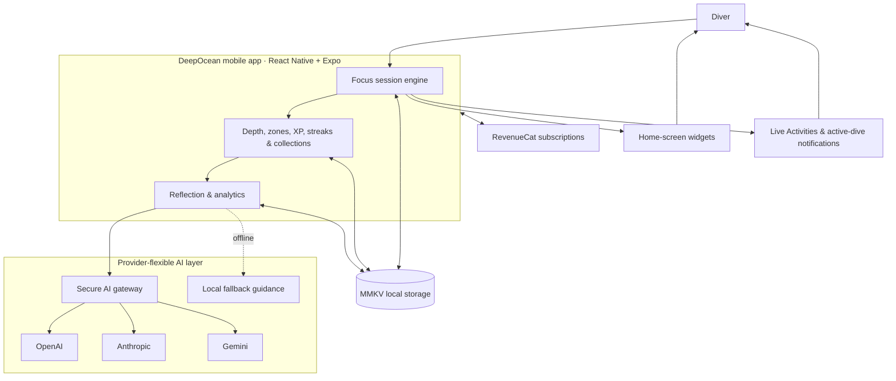

<div align="center">
  <a href="https://deepocean.io.vn">
    
  </a>

# DeepOcean

### Dive deep. Focus deeper.

Transform every focus session into an ocean exploration adventure—then surface with stronger habits, meaningful discoveries, and a clearer understanding of how you work best.

[](https://deepocean.io.vn)


[](#technology-stack)
[](#technology-stack)

[Explore DeepOcean](https://deepocean.io.vn) · [See the experience](#product-screens) · [Run locally](#local-development)

</div>

---

## A calmer way to do meaningful work

DeepOcean is an AI-powered focus and mindfulness app that turns concentrated time into a living deep-sea journey. Start a timed session or free dive, descend through distinct ocean zones while you work, discover creatures and artifacts, and build an expedition log that reflects real effort.

It is designed for students, developers, creators, remote workers, people with ADHD, deep-work enthusiasts, and anyone who wants a productivity ritual that feels rewarding without becoming noisy.

<table>
  <tr>
    <td align="center"></td>
    <td align="center"></td>
    <td align="center"></td>
    <td align="center"></td>
    <td align="center"></td>
  </tr>
  <tr>
    <td align="center"><sub>Home</sub></td>
    <td align="center"><sub>Focus dive</sub></td>
    <td align="center"><sub>AI companion</sub></td>
    <td align="center"><sub>Statistics</sub></td>
    <td align="center"><sub>Widget</sub></td>
  </tr>
</table>

> [!NOTE]
> Production screenshots are not committed yet. Add them to [`public/screenshots/`](./public/screenshots/) using the filenames referenced above. Until then, the image links act as intentional TODO placeholders.

## What is DeepOcean?

Most focus apps stop at the countdown. They tell you how long you worked, but give you little reason to begin again tomorrow. A blank timer can quickly become another obligation: useful, efficient, and emotionally forgettable.

DeepOcean makes focus feel like movement.

Every minute takes you farther beneath the surface. Longer sessions reveal deeper zones, completed dives expand your collection, and consistent practice develops a personal ocean shaped by the time you protected. The progression is gentle but visible—enough to make starting feel inviting and returning feel worthwhile.

Gamification matters because habits grow faster when effort creates immediate, meaningful feedback. Ocean exploration offers a natural metaphor for deep work: the farther attention travels, the quieter the surface becomes. Instead of chasing points for their own sake, users build an expedition history from genuine concentration.

After a session, the AI reflection companion helps turn activity into insight. It can connect recent focus patterns, goals, mood, streaks, and session history into practical guidance, helping users notice what works and choose a better next dive. The result is more than a timer: it is a repeatable ritual for focus, mindfulness, and self-understanding.

## Features

### 🌊 Ocean Focus Sessions

Choose a quick duration, set a custom timer, or begin an open-ended free dive. Focused minutes become depth as you descend from the Sunlight Zone toward the Hadal Trench.

**Benefit:** Make starting easier and sustained attention feel tangible.

### AI Reflection Companion

Receive context-aware reflections shaped by goals, recent sessions, mood, streaks, achievements, and unlocked zones, with graceful local fallback when hosted AI is unavailable.

**Benefit:** Turn raw session data into a useful next step instead of another dashboard to interpret.

### Ocean Collections

Discover creatures, artifacts, rarities, lore, and sealed expedition notes tied to the depths you reach.

**Benefit:** Build a personal collection that represents time genuinely spent learning, creating, and working.

### Discovery System

Completed sessions can reveal zone-specific discoveries across an evolving catalog of more than 160 entries.

**Benefit:** Add anticipation and surprise without distracting from the work itself.

### Statistics Dashboard

Review total focus, weekly rhythm, maximum depth, discoveries, session trends, and long-term progress in one calm view.

**Benefit:** Understand consistency at a glance and make better decisions about when and how to focus.

### Focus History

Every completed dive becomes a dated expedition record with duration, depth, XP, zone, and discoveries.

**Benefit:** Create an honest archive of progress that is easier to trust than memory or motivation.

### Widgets

See daily progress, streaks, current depth, focus targets, and discoveries—or jump directly into a session—from the home screen.

**Benefit:** Reduce the friction between deciding to focus and actually beginning.

### Live Activities

Follow an active timed dive outside the app through iPhone Live Activities, background completion notifications, and Android active-dive notifications.

**Benefit:** Stay aware of the session without reopening the app or breaking concentration.

### Premium Themes

DeepOcean Pro unlocks seven visual identities with distinct palettes, typography, gradients, particles, and ambient effects.

**Benefit:** Make the focus environment feel personal while keeping the core experience calm and coherent.

### Streak Tracking

Track current and longest streaks alongside levels, XP, titles, achievements, and zone unlocks.

**Benefit:** Reward returning consistently—not merely completing one heroic session.

### Deep Work Analytics

Explore weekly patterns, mood-correlated trends, preferred session lengths, depth records, and AI-assisted focus plans.

**Benefit:** Replace productivity guesswork with patterns drawn from actual behavior.

## Product screens

| Home | Dive session |
|:---:|:---:|
|  |  |
| Daily guidance, quick-start durations, streaks, level, and recent progress. | A cinematic, low-distraction timer with depth, zone, pause, surface, and discovery states. |

| Collection | AI companion |
|:---:|:---:|
|  |  |
| Creatures, artifacts, rarity, sightings, lore, and expedition notes earned through focus. | Personal reflections and practical guidance informed by goals and recent focus behavior. |

| Statistics | Premium |
|:---:|:---:|
|  |  |
| Weekly focus shape, expedition history, records, streaks, and long-term progression. | Premium themes, deeper insights, full field journals, and an enhanced ocean experience. |

> [!IMPORTANT]
> Screenshot TODO: replace `home.png`, `dive.png`, `collection.png`, `ai.png`, `stats.png`, `premium.png`, and `widget.png` in `public/screenshots/` with final production captures. Portrait app screens work best at a consistent aspect ratio and resolution.

## Why DeepOcean is different

| Feature | DeepOcean | Traditional focus apps |
|---|---|---|
| AI reflection | Context-aware guidance informed by goals and focus history | Usually absent or limited to generic summaries |
| Ocean exploration | Focus time becomes depth across five evolving zones | Time remains a number on a countdown |
| Collection system | Sessions unlock creatures, artifacts, lore, and discoveries | Little lasting evidence beyond completed sessions |
| Dynamic themes | Immersive app-wide visual identities and ambient effects | Static colors or basic light and dark modes |
| Gamification | XP, levels, streaks, titles, zones, and meaningful collections | Streak counters or isolated badges |
| Widgets | Progress, shortcuts, targets, and dive status at a glance | Basic timer shortcut or no widget support |
| Live Activities | Active dive progress beyond the app on supported devices | Requires reopening the app to check progress |

## Focus that feels worth returning to

DeepOcean is a **focus timer app** for people who want more atmosphere and meaning than a standard countdown. It combines the practical structure of a **productivity app**, the calmer rhythm of a **mindfulness app**, and the progression of a habit-building game.

As a **deep work app** and **Pomodoro alternative**, it supports fixed sessions, custom durations, and open-ended work rather than forcing every user into one technique. Students can use it as a **study timer app**; creators and developers can use it to protect uninterrupted work; and people seeking an **AI productivity assistant** can reflect on patterns instead of relying on generic advice.

Underwater ambience and calm sensory feedback give DeepOcean the atmosphere people often seek in a **focus music app**, while its native mobile foundation makes it a useful reference point for anyone interested in a thoughtfully designed **React Native productivity app**.

## Technology stack

This repository contains the production marketing website. The mobile product architecture is documented alongside it so contributors can understand the complete DeepOcean ecosystem.

| Layer | Technology | Purpose |
|---|---|---|
| Marketing website | Next.js 16, React 19, TypeScript | Product discovery, SEO, and responsive marketing experience |
| Styling and motion | Tailwind CSS 4, Framer Motion, Lucide React | Visual system, interaction, and iconography |
| Mobile application | React Native, Expo, TypeScript | Shared iOS and Android product experience |
| Local storage | MMKV | Fast, persistent local state and offline-first session data |
| Server state | React Query | Async data fetching, caching, and synchronization |
| Subscriptions | RevenueCat | Cross-platform premium entitlements and purchase lifecycle |
| AI layer | OpenAI, Anthropic, Gemini | Provider-flexible reflection, guidance, and insight generation |
| Native surfaces | Widget extensions, Live Activities | Glanceable progress and active-session updates outside the app |

> [!TIP]
> The dependencies in the mobile rows describe the wider DeepOcean product. This `DeepOcean-webapp` package itself currently installs only the website dependencies declared in [`package.json`](./package.json).

## Local development

### Prerequisites

- Node.js 20 or newer
- npm 10 or newer

### Install

```bash
git clone https://github.com/tonyyph/DeepOcean-webapp.git
cd DeepOcean-webapp
npm ci
```

### Environment variables

Copy the example environment file:

```bash
cp .env.example .env.local
```

| Variable | Required | Default | Description |
|---|:---:|---|---|
| `NEXT_PUBLIC_SITE_URL` | No | `https://deepocean.io.vn` | Canonical base URL used by metadata, sitemap, robots, and social sharing |

AI provider credentials and RevenueCat keys belong to the mobile app or a secure server-side integration. They are not read by this marketing website and should never be exposed through public `NEXT_PUBLIC_*` variables.

### Run

Start the development server:

```bash
npm run dev
```

Open [http://localhost:3000](http://localhost:3000).

### Quality checks

```bash
npm run lint
npm run typecheck
npm run build
```

### Production build

```bash
npm run build
npm run start
```

The site is optimized for a standard Next.js deployment. When deploying to Vercel, set `NEXT_PUBLIC_SITE_URL=https://deepocean.io.vn`, then connect the production domain.

## Architecture overview



The session engine remains the source of truth. Local persistence keeps the core experience responsive and resilient, while widgets and Live Activities receive a consistent projection of active-dive state. Hosted AI enriches reflection when available; deterministic local guidance preserves a useful offline experience.

## Roadmap

- [ ] Apple Watch companion
- [ ] Wear OS companion
- [ ] Ocean Events
- [ ] Community Challenges
- [ ] Focus Rooms
- [ ] AI Voice Companion
- [ ] Multiplayer deep focus expeditions

Roadmap items express direction rather than guaranteed release dates. Priorities may change as DeepOcean learns from real divers.

## SEO and social metadata

Use the following copy for app listings, search results, link previews, and launch materials:

| Field | Recommended copy |
|---|---|
| **Meta title** | DeepOcean — AI Focus Timer & Deep Work App |
| **Meta description** | Turn focus sessions into deep-sea journeys with AI reflections, ocean discoveries, streaks, widgets, and mindful productivity tools. |
| **OpenGraph description** | Dive into focused work. DeepOcean transforms every session into an evolving ocean adventure with discoveries, progress, and personal AI guidance. |
| **Twitter description** | Focus deeper, explore farther. DeepOcean turns deep work into an ocean journey with AI reflections, collections, streaks, and calm progression. |

## Contributing

Issues and thoughtful proposals are welcome. Before opening a pull request:

1. Keep product language calm, specific, and accessible.
2. Preserve responsive behavior and reduced-motion support.
3. Run `npm run lint`, `npm run typecheck`, and `npm run build`.
4. Include screenshots for visual changes.

No `LICENSE` file is currently included. Until one is added, the repository should not be assumed to grant open-source reuse, modification, or redistribution rights.

---

<div align="center">

## Ready to go below the surface?

**Dive deeper.**<br />
**Stay focused.**<br />
**Discover your ocean.**

[**Visit DeepOcean →**](https://deepocean.io.vn)

</div>
